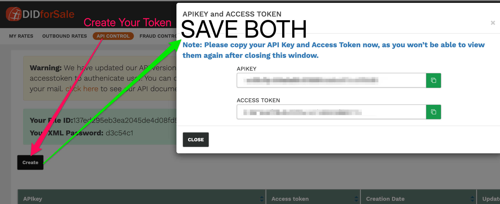
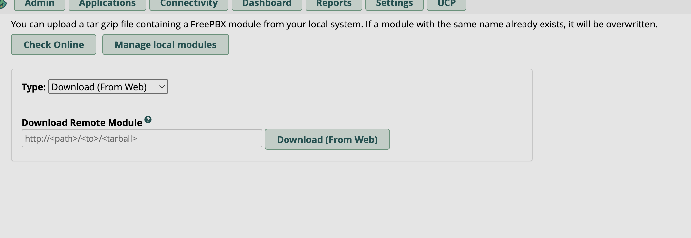
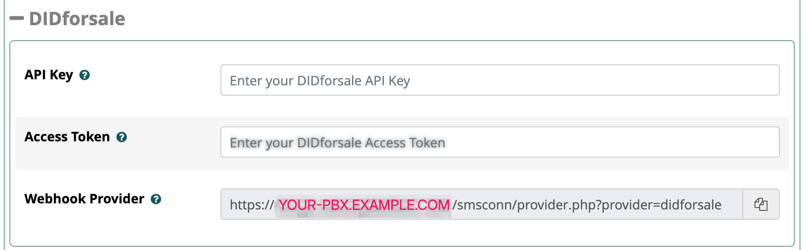
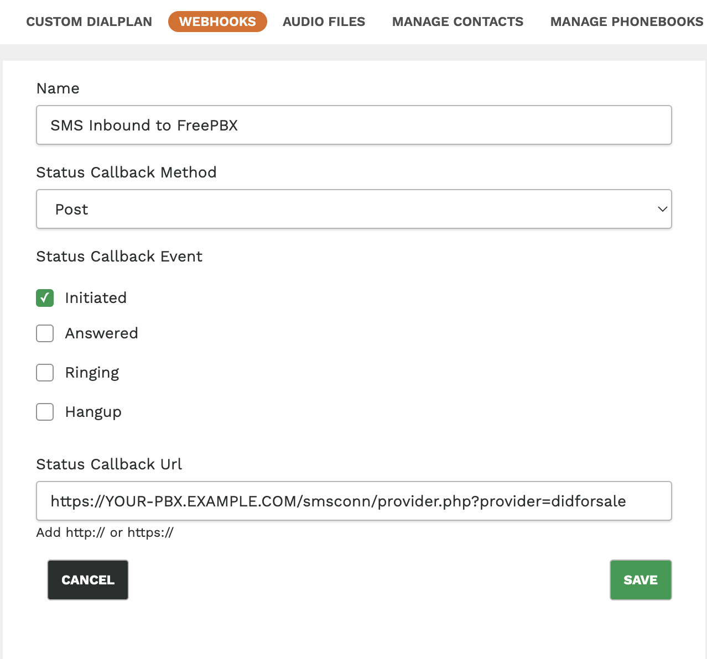
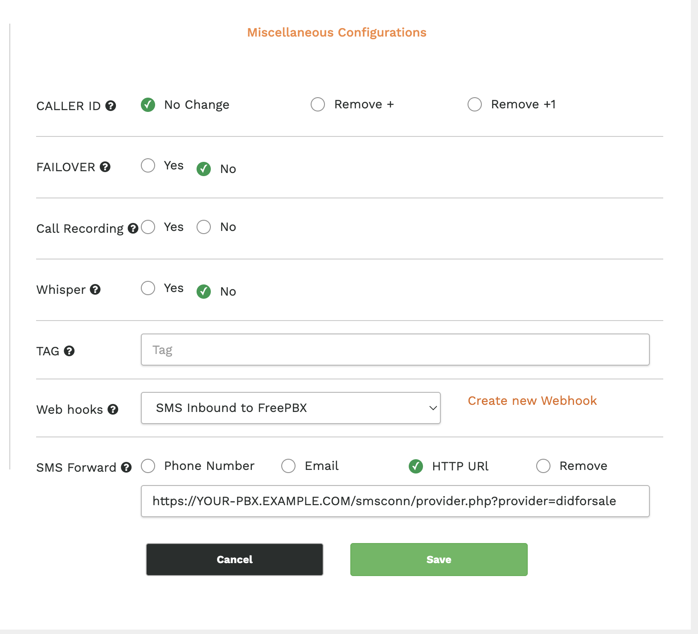
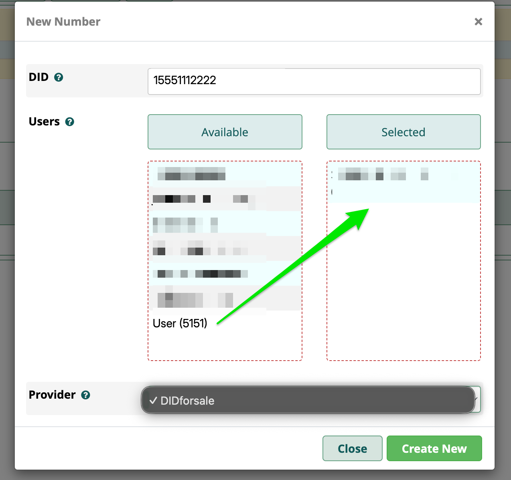
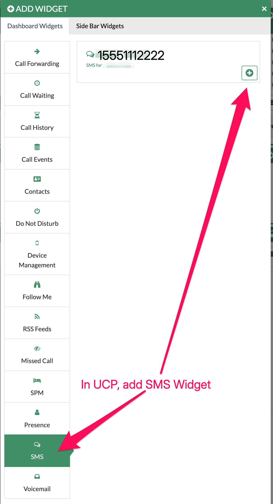
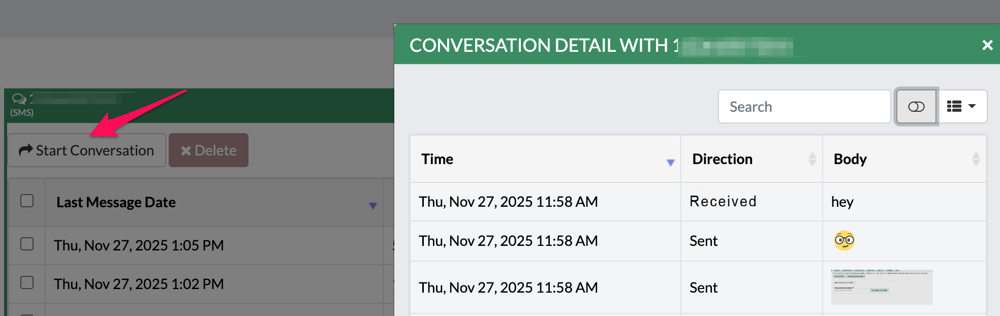

# DIDforsale Provider

This is the 'missing manual' for how to configure and test the DIDforsale provider for the SMS Connector module for use in FreePBX.

## Summary
- Provider: `providers/provider-Didforsale.php`
- API: DIDforsale API v4.0
- Features: Outbound SMS, MMS (via `media_urls`), inbound webhook handling, dual-credential auth (API Key + Access Token)

## Prerequisites
Before starting, ensure you have:
- A DIDforsale account with API access
- **Campaign Registry**: Register your phone number(s) and brand in the DIDforsale Campaign Registry (required for outbound SMS delivery)
- FreePBX 16.0+ running on a publicly accessible server with a valid HTTPS certificate
- Your FreePBX Web Address configured in **Advanced Settings** (without `https://` prefix, e.g., `YOUR-PBX.EXAMPLE.COM`)

## Setup Guide

### Step 1: Generate API Access Token in DIDforsale
Log into your DIDforsale account and generate an API Access Token. Save both your API Key and Access Token securely.



### Step 2: Add SMS Connector Module to FreePBX
Install the SMS Connector module:

1. Go to FreePBX Admin → Module Admin → Upload
2. Paste the following URL in "Download Remote Module" and enable:
   ```
   https://github.com/skybird-dev/smsconnector/releases/download/v16.0.19/smsconnector-16.0.19.tar.gz
   ```



### Step 3: Configure DIDforsale Provider in FreePBX
In the SMS Connector UI, open **Provider Settings.** Select **DIDforsale.**  

**Fields to enter:**
- **API Key** (`apikey`) - required
- **Access Token** (`api_secret`) - required (API v4.0)

Paste your API Key and Access Token. You'll also see the webhook provider URL displayed—**copy this URL**, you'll need it for Steps 4 and 5:



### Step 4: Create Webhook in DIDforsale
Log back into DIDforsale and create a webhook called "SMS Inbound to FreePBX." Tick the "Initiated" checkbox.
In "Status Callback URL" paste the FreePBX callback URL you copied in Step 3 and click Save:



### Step 5: Configure Webhook URL in DIDforsale Portal
1. Go to https://portal.didforsale.com/products/phone_numbers and click the phone number you wish to configure SMS for.
2. On the right side under "Miscellaneous Configurations," select the Web Hook you made in Step 4. 
3. Below that, you'll see "SMS Forward." Click the "HTTP URL" radio button, then paste the URL from Step 3 and click Save:



### Step 6: Add Phone Number and Select DIDforsale Provider
In FreePBX SMS Connector, add your DID (phone number) and the extensions that apply, then make sure DIDforsale is the SMS provider:



### Step 7: Add UCP SMS Dashboard Widget
To allow users to send/receive SMS through UCP, add the SMS Dashboard Widget:



Users can then click "Start Conversation." Conversation history is available as well.



#### Note: In your mobile softphone apps, make sure you enable SMS.

## How Does It Work? 

### Webhook (Inbound SMS)
- Webhook URL: `https://<your-hostname>/smsconn/provider.php?provider=didforsale`
- DIDforsale sends `from`, `to`, `text` parameters via POST (or GET). The provider accepts either.
- Example webhook test using `curl`:

```
curl -X POST \
  -d "from=+15551112222" \
  -d "to=+15551112222" \
  -d "text=Test from DIDforsale" \
  https://<your-hostname>/smsconn/provider.php?provider=didforsale
```

Notes:
- The module stores inbound messages in the `sms_messages` table and emits the standard SMS inbound event so UCP and other modules receive notifications.

### Outbound SMS/MMS
- Endpoint used: `https://api.didforsale.com/didforsaleapi/index.php/api/V4/SMS/Send`
- Authentication: `APIKEY` and `accesstoken` are sent as HTTP headers by the provider implementation.
- MMS: image URLs may be automatically generated in `media_urls` field (in module `sendMedia()`).

Example outbound curl (what the provider sends):

```
POST /didforsaleapi/index.php/api/V4/SMS/Send HTTP/1.1
Host: api.didforsale.com
Content-Type: application/json
APIKEY: <your-apikey>
accesstoken: <your-access-token>

{
  "from": "+1555...",
  "to": "+1555...",
  "text": "Hello from OnlineSystems",
  "media_urls": ["https://example.com/image.jpg"]
}
```

## Known Notes & Troubleshooting
- Ensure the DID used for inbound tests exists in the SMS Connector DID list; otherwise the inbound handler will fail with a missing `didid` mapping.
- If outbound sends fail with authentication errors, verify your DIDforsale account has the correct API credentials and that any regional/campaign registration (required by DIDforsale for certain origination) is completed.
- The provider logs failures using FreePBX logging (search for `DIDforsale Send Failed:` in logs).

## Compatibility
- Module Version: 16.0.19 (this change)
- FreePBX Versions: 16.0+
- FreePBX 17+: Compatible with the exception of issue #87 (https://github.com/simontelephonics/smsconnector/issues/87)
